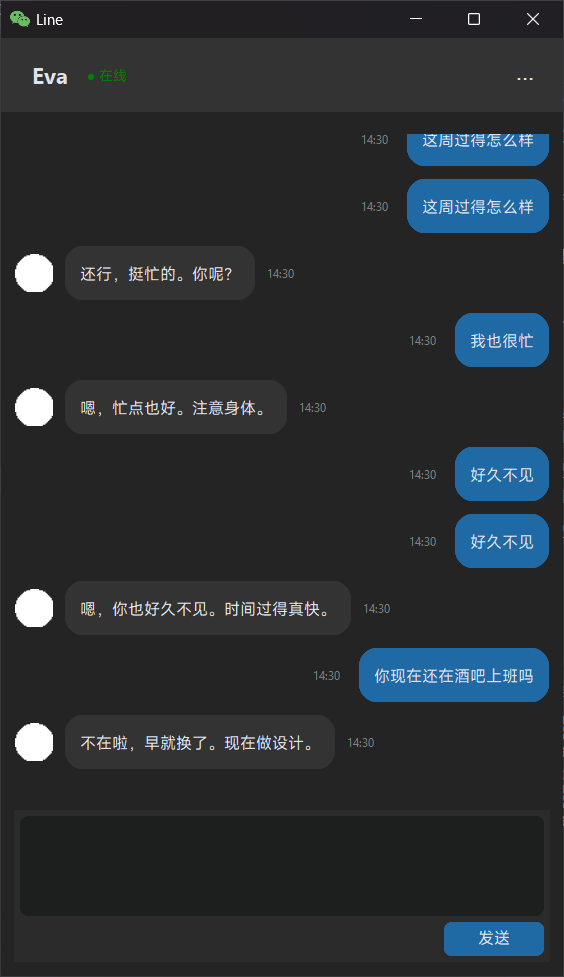

# Line - AI Chat Application

<div align="center">

**一个基于设计模式的现代化 AI 聊天应用**

*A Modern AI Chat Application Built with Design Patterns*

[](https://www.python.org/)
[](https://customtkinter.tomschimansky.com/)
[](https://platform.deepseek.com/)

</div>

---

<div align="center">



*Line AI Chat Application Interface*

</div>

---

## 📖 项目描述 | Project Description

Line 是一个优雅的 AI 聊天客户端应用程序，模拟与前任女友的对话场景。项目采用多种经典设计模式，确保代码的可维护性、可扩展性和清晰度。

Line is an elegant AI chat client application that simulates conversation scenarios with an ex-girlfriend. The project employs multiple classic design patterns to ensure code maintainability, scalability, and clarity.

### ✨ 特性 | Features

- 🎨 **现代化 UI** - 基于 CustomTkinter 的深色主题界面
- 🤖 **AI 驱动** - 集成 DeepSeek API，提供智能对话能力
- 🏗️ **设计模式** - 应用 **12 种**设计模式，构建清晰的代码架构
- 💾 **数据持久化** - PostgreSQL 数据库存储聊天记录
- 🌐 **双语支持** - 完整的中英文文档和注释

---

## 🛠️ 技术栈 | Tech Stack

### 核心框架 | Core Framework
- **Python 3.12+** - 主要编程语言
- **CustomTkinter 5.0+** - 现代化 GUI 框架
- **Pillow** - 图像处理

### AI 与 API | AI & API
- **DeepSeek API** - AI 对话引擎
- **OpenAI SDK** - API 客户端库
- **python-dotenv** - 环境变量管理

### 数据库 | Database
- **PostgreSQL** - 关系型数据库
- **psycopg2** - PostgreSQL 适配器

### 设计模式 | Design Patterns

#### 创建型模式 (Creational Patterns) - 5 种
1. **单例模式 (Singleton)** - 主窗口、享元工厂 ⭐
2. **抽象工厂模式 (Abstract Factory)** - SQL 管理器创建
3. **简单工厂模式 (Simple Factory)** - 管理器工厂、日志格式化器工厂 ⭐
4. **工厂方法模式 (Factory Method)** - 日志策略创建 ⭐
5. **建造者模式 (Builder)** - UI 组合构建、数据对象构建

#### 结构型模式 (Structural Patterns) - 6 种
6. **桥接模式 (Bridge)** - UI 组件抽象 ⭐
7. **组合模式 (Composite)** - UI 组件树 ⭐
8. **装饰模式 (Decorator)** - UI 功能增强 ⭐
9. **外观模式 (Facade)** - 消息渲染外观 ⭐ NEW
10. **享元模式 (Flyweight)** - UI 对象缓存 ⭐ NEW
11. **代理模式 (Proxy)** - 应用程序启动代理 ⭐ NEW
12. **适配器模式 (Adapter)** - 日志记录器

#### 行为型模式 (Behavioral Patterns) - 1 种
13. **策略模式 (Strategy)** - 日志格式化策略 ⭐ NEW

---

## 📦 安装与配置 | Installation & Configuration

### 1. 环境要求 | Requirements

```bash
Python 3.12 或更高版本
PostgreSQL 12 或更高版本
```

### 2. 安装依赖 | Install Dependencies

```bash
pip install -r requirements.txt
```

### 3. 配置环境变量 | Configure Environment Variables

**重要：** 将 `.env.example` 文件重命名为 `.env`，并填写配置信息

**Important:** Rename `.env.example` to `.env` and fill in the configuration

```bash
# 复制示例配置文件
cp .env.example .env

# 编辑 .env 文件，填入你的配置
# API_KEY=your_api_key_here
# BASE_URL=https://api.deepseek.com
# MODEL=deepseek-reasoner
```

### 4. 数据库配置 | Database Configuration

#### WSL 环境配置 | WSL Environment Setup

**注意：** PostgreSQL 运行在 WSL (Windows Subsystem for Linux) 中

**Note:** PostgreSQL runs in WSL (Windows Subsystem for Linux)

```bash
# 1. 进入 WSL
wsl

# 2. 启动 PostgreSQL 服务
sudo service postgresql start

# 3. 切换到 postgres 用户
sudo -i -u postgres

# 4. 进入 PostgreSQL 命令行
psql
```

#### 数据库创建 | Database Creation

```sql
-- 创建数据库
CREATE DATABASE records;

-- 切换到数据库
\c records;

-- 创建聊天记录表
CREATE TABLE chat_messages (
    id SERIAL PRIMARY KEY,
    sender VARCHAR(10) NOT NULL,
    content TEXT NOT NULL,
    created_at TIMESTAMP NOT NULL,
    updated_at TIMESTAMP NOT NULL
);

-- 创建索引以优化查询性能
CREATE INDEX idx_updated_at ON chat_messages(updated_at DESC);

-- 设置默认权限（如果需要）
GRANT ALL PRIVILEGES ON DATABASE records TO howxu;
GRANT ALL PRIVILEGES ON TABLE chat_messages TO howxu;
GRANT USAGE, SELECT ON SEQUENCE chat_messages_id_seq TO howxu;
```

#### 连接配置 | Connection Configuration

默认数据库连接参数（在 `server/sql.py` 中配置）：

Default database connection parameters (configured in `server/sql.py`):

```python
conn_params = {
    'host': '127.0.0.1',      # WSL 中的 PostgreSQL
    'port': '5432',           # 默认 PostgreSQL 端口
    'database': 'records',    # 数据库名称
    'user': 'howxu',          # 用户名
    'password': 'howxu'       # 密码
}
```

**重要提示：** 从 Windows 访问 WSL 中的 PostgreSQL，需要确保：

**Important:** To access PostgreSQL in WSL from Windows, ensure:

1. PostgreSQL 监听所有网络接口（修改 `postgresql.conf` 中的 `listen_addresses = '*'`）
2. 配置 `pg_hba.conf` 允许远程连接
3. WSL 防火墙允许 5432 端口

---

## 🚀 使用方法 | Usage

### 启动应用 | Start Application

```bash
python main.py
```

### 项目结构 | Project Structure

```
SheJiMode/
├── client/                 # 客户端 UI 模块
│   ├── window.py          # 主窗口（单例模式）
│   ├── ui_component.py    # UI 组件（桥接模式）⭐
│   ├── ui_composite.py    # UI 组合（组合模式）⭐
│   ├── ui_decorator.py    # UI 装饰器（装饰模式）⭐
│   ├── ui_facade.py       # UI 渲染外观（外观模式）⭐ NEW
│   └── ui_flyweight.py    # UI 享元工厂（享元模式）⭐ NEW
├── server/                # 服务端逻辑模块
│   ├── factory.py         # 管理器工厂（简单工厂模式）
│   ├── sql.py             # SQL 管理器（抽象工厂模式）
│   ├── data.py            # 数据管理（建造者模式）
│   ├── ai.py              # AI API 集成
│   ├── logger.py          # 日志适配器（适配器模式）
│   ├── log_strategy.py    # 日志策略（工厂方法模式）⭐ NEW
│   └── log_formatter_factory.py  # 日志格式化器工厂（简单工厂模式）⭐ NEW
├── resources/             # 资源文件
│   ├── icon.ico          # 应用图标
│   └── ta.png            # 头像图片
├── main.py               # 程序入口（代理模式）⭐ NEW
├── .env                  # 环境变量配置（需自行创建）
└── README.md             # 项目文档
```

---

## 📝 开发指南 | Development Guide

### 代码规范 | Code Style

- 遵循 PEP 8 编码规范
- 使用类型注解（Type Hints）
- 函数和类必须有清晰的文档字符串
- 保持单一职责原则

### 添加新的 UI 组件 | Adding New UI Components

使用桥接模式，在 `ui_component.py` 中添加：

```python
class NewComponent(UIComponent):
    def __init__(self, **kwargs):
        # 初始化参数
        pass
    
    def create(self, parent):
        # 创建组件
        pass
    
    def get_component(self):
        # 返回组件实例
        pass
```

### 添加新的装饰器 | Adding New Decorators

在 `ui_decorator.py` 中添加：

```python
class NewDecorator(UIDecorator):
    def build(self, parent):
        widget = super().build(parent)
        # 添加额外功能
        return widget
```

### 设计模式应用原则 | Design Pattern Principles

1. **不要过度设计** - 只在必要时使用设计模式
2. **保持简洁** - 优先选择最简单的解决方案
3. **可测试性** - 确保代码易于单元测试
4. **文档化** - 为复杂逻辑添加清晰的注释

---

## 🎨 设计模式详解 | Design Patterns Details

本项目共应用 **13 种** 设计模式（其中包含"工厂方法 + 简单工厂"两种创建型变体）。
下表给出"模式名 → 角色 → 类 → 关键代码片段"四元组，确保文档与代码 1:1 对应。

| 编号 | 模式 | 类别 | 关键文件 |
| --- | --- | --- | --- |
| 1 | 单例模式 (Singleton) | 创建型 | `client/window.py`, `client/ui_flyweight.py` |
| 2 | 抽象工厂模式 (Abstract Factory) | 创建型 | `server/sql.py` |
| 3 | 简单工厂模式 (Simple Factory) | 创建型 | `server/factory.py`, `server/log_formatter_factory.py` |
| 4 | 工厂方法模式 (Factory Method) | 创建型 | `server/log_strategy.py` |
| 5 | 建造者模式 (Builder) | 创建型 | `client/ui_composite.py`, `server/data.py` |
| 6 | 桥接模式 (Bridge) | 结构型 | `client/ui_component.py` |
| 7 | 组合模式 (Composite) | 结构型 | `client/ui_composite.py` |
| 8 | 装饰模式 (Decorator) | 结构型 | `client/ui_decorator.py` |
| 9 | 外观模式 (Facade) | 结构型 | `client/ui_facade.py` |
| 10 | 享元模式 (Flyweight) | 结构型 | `client/ui_flyweight.py` |
| 11 | 代理模式 (Proxy) | 结构型 | `main.py` |
| 12 | 适配器模式 (Adapter) | 结构型 | `server/logger.py` |
| 13 | 策略模式 (Strategy) | 行为型 | `server/log_strategy.py`, `server/ai.py` |

---

### 创建型模式 | Creational Patterns

#### 1. 单例模式 (Singleton) ⭐

- **角色与类**：
  | 角色 | 类 | 位置 |
  | --- | --- | --- |
  | Singleton | `MainWindow` | `client/window.py` |
  | Singleton | `UIFlyweightFactory` | `client/ui_flyweight.py` |
- **关键代码**（`client/window.py`）：
  ```python
  class MainWindow:
      _instance = None
      _lock = threading.Lock()
      _initialized = False

      def __new__(cls, *args, **kwargs):
          if cls._instance is None:
              with cls._lock:                       # 线程安全
                  if cls._instance is None:
                      cls._instance = super().__new__(cls)
          return cls._instance

      def __init__(self, dataManager, deepSeekAPI):
          with MainWindow._lock:
              if MainWindow._initialized:           # 仅首次真正初始化
                  return
              # ... 业务属性赋值
              MainWindow._initialized = True
  ```
- **关键代码**（`client/ui_flyweight.py`）：
  ```python
  class UIFlyweightFactory:
      _instance = None
      _lock = threading.Lock()

      def __new__(cls, *args, **kwargs):
          with cls._lock:
              if cls._instance is None:
                  cls._instance = super().__new__(cls)
          return cls._instance
  ```
- **调用链**：`ApplicationProxy.launch()` → `RealApplication.initialize()` → `ManagerFactory()` → `MainWindow(...)`（后续调用直接返回已缓存实例）。

#### 2. 抽象工厂模式 (Abstract Factory) ⭐

- **角色与类**：
  | 角色 | 类 | 位置 |
  | --- | --- | --- |
  | AbstractFactory | `SQLFactory` | `server/sql.py` |
  | ConcreteFactory | `PostgreSQLFactory` / `MySQLFactory` | `server/sql.py` |
  | AbstractProduct A | `SQLManager` | `server/sql.py` |
  | ConcreteProduct A1 | `PostgreSQLManager` | `server/sql.py` |
  | ConcreteProduct A2 | `MySQLManager` | `server/sql.py` |
  | AbstractProduct B | `SQLConnection` | `server/sql.py` |
  | ConcreteProduct B1 | `PostgreSQLConnection` | `server/sql.py` |
  | ConcreteProduct B2 | `MySQLConnection` | `server/sql.py` |
  | Factory Selector | `create_sql_factory(vendor)` | `server/sql.py` |
- **设计意图**：以"数据库族"为切换单位，工厂接口一次性产出一组相关产品（`SQLManager` + `SQLConnection`），保证系列产品之间互相兼容。
- **关键代码**（`server/sql.py`）：
  ```python
  class SQLFactory(ABC):
      @abstractmethod
      def create_sql_manager(self, dataManager) -> SQLManager: ...
      @abstractmethod
      def create_sql_connection(self) -> SQLConnection: ...

  class PostgreSQLFactory(SQLFactory):
      def create_sql_manager(self, dataManager):
          return PostgreSQLManager(dataManager)
      def create_sql_connection(self):
          return PostgreSQLConnection()

  class MySQLFactory(SQLFactory):
      def create_sql_manager(self, dataManager):
          return MySQLManager(dataManager)
      def create_sql_connection(self):
          return MySQLConnection()

  def create_sql_factory(vendor: str = "postgresql") -> SQLFactory:
      if vendor == "postgresql": return PostgreSQLFactory()
      if vendor == "mysql":      return MySQLFactory()
      raise ValueError(...)
  ```
- **调用链**：`ManagerFactory.__init__()` → `create_sql_factory("postgresql")` → `factory.create_sql_manager(...)` + `factory.create_sql_connection()`。

#### 3. 简单工厂模式 (Simple Factory) ⭐

- **角色与类**：
  | 角色 | 类 | 位置 |
  | --- | --- | --- |
  | SimpleFactory | `ManagerFactory` | `server/factory.py` |
  | SimpleFactory | `LogFormatterFactory` | `server/log_formatter_factory.py` |
- **关键代码**（`server/factory.py`）：
  ```python
  class ManagerFactory:
      def __init__(self, sql_vendor: str = "postgresql"):
          self.dataManager = DataManager()
          sql_factory = create_sql_factory(sql_vendor)
          self.sqlManager  = sql_factory.create_sql_manager(self.dataManager)
          self.sqlConnection = sql_factory.create_sql_connection()
          ...
      def get_manager(self, category: str):
          match category:
              case "sql":        return self.sqlManager
              case "connection": return self.sqlConnection
              case "data":       return self.dataManager
              case "api":        return self.deepseekAPI
  ```
- **关键代码**（`server/log_formatter_factory.py`）：
  ```python
  class LogFormatterFactory:
      _strategies = {"api": APILogStrategy, "request": RequestLogStrategy, ...}
      @classmethod
      def create(cls, log_type): return cls._strategies[log_type.lower()]()
  ```

#### 4. 工厂方法模式 (Factory Method) ⭐

- **角色与类**：
  | 角色 | 类 | 位置 |
  | --- | --- | --- |
  | Product | `LogStrategy` | `server/log_strategy.py` |
  | ConcreteProduct | `APILogStrategy` / `RequestLogStrategy` / `ResponseLogStrategy` / `DebugLogStrategy` | `server/log_strategy.py` |
  | Creator（抽象） | `LogStrategyCreator` | `server/log_strategy.py` |
  | ConcreteCreator | `APILogCreator` / `RequestLogCreator` / `ResponseLogCreator` / `DebugLogCreator` | `server/log_strategy.py` |
  | Creator 注册表 | `LogFormatterFactory._creators` | `server/log_formatter_factory.py` |
- **设计意图**：将"对象创建"延迟到子类，调用方只依赖 `Creator` 抽象层。新增日志类型时只需新增 Product + Creator，不修改既有工厂逻辑。
- **关键代码**（`server/log_strategy.py`）：
  ```python
  class LogStrategyCreator(ABC):
      @abstractmethod
      def create_strategy(self) -> LogStrategy: ...

      def log(self, data, prefix="", max_length=200):
          # 模板方法：Creator 统一约束调用流程
          strategy = self.create_strategy()
          strategy.log(data, prefix=prefix, max_length=max_length)

  class APILogCreator(LogStrategyCreator):
      def create_strategy(self) -> LogStrategy:
          return APILogStrategy()
  ```
- **调用链**：`DeepSeekAPI.__init__()` → `get_creator("request")` → `RequestLogCreator` → `RequestLogCreator.create_strategy()` → `RequestLogStrategy`。

#### 5. 建造者模式 (Builder) ⭐

##### 5.1 UI 复合树构建
- **角色与类**：
  | 角色 | 类 | 位置 |
  | --- | --- | --- |
  | Product | `UIComposite` | `client/ui_composite.py` |
  | Builder（抽象） | `UIBuilder` | `client/ui_composite.py` |
  | ConcreteBuilder | `UICompositeBuilder` | `client/ui_composite.py` |
  | Director | `UIDirector` | `client/ui_composite.py` |
- **关键代码**（`client/ui_composite.py`）：
  ```python
  class UIComposite:
      def __init__(self):
          self._root: UIElement = None
      def set_root(self, root): self._root = root
      def get_root(self):       return self._root
      def build(self, parent):  return self._root.build(parent)

  class UICompositeBuilder(UIBuilder):
      def set_root(self, root): ...
      def add_frame(self, component, pack_config=None): ...   # 链式
      def add_label(self, component, pack_config=None): ...
      def add_button(self, component, pack_config=None): ...
      def add_textbox(self, component, pack_config=None): ...
      def end_frame(self): ...
      def get_product(self) -> UIComposite: ...

  class UIDirector:
      def build_chat_window(self, components: dict) -> UIComposite: ...
  ```

##### 5.2 Data 对象构建
- **角色与类**：
  | 角色 | 类 | 位置 |
  | --- | --- | --- |
  | Product | `Data` | `server/data.py` |
  | Builder（抽象） | `DataBuilder` | `server/data.py` |
  | ConcreteBuilder | `DefaultDataBuilder` | `server/data.py` |
  | Director | `DataDirector` | `server/data.py` |
- **关键代码**（`server/data.py`）：
  ```python
  class DefaultDataBuilder(DataBuilder):
      def __init__(self): self._data = Data()
      def set_inner_conext(self, v):   self._data.inner_conext   = v; return self
      def set_display_conext(self, v): self._data.display_conext = v; return self
      def set_prompt(self, v):         self._data.prompt         = v; return self
      def build(self) -> Data: ...

  class DataDirector:
      def make_empty_session(self) -> Data:
          return (self._builder.reset()
                  .set_display_conext([]).set_inner_conext([])
                  .set_prompt([{"role": "system", "content": system_prompt}])
                  .build())
  ```
- **调用链**：`DataManager.__init__()` → `DataDirector.make_empty_session()` → `DefaultDataBuilder.build()`。

---

### 结构型模式 | Structural Patterns

#### 6. 桥接模式 (Bridge) ⭐

- **角色与类**：
  | 角色 | 类 | 位置 |
  | --- | --- | --- |
  | Abstraction | `UIComponent` | `client/ui_component.py` |
  | RefinedAbstraction | `FrameComponent` / `LabelComponent` / `ButtonComponent` / `ScrollableFrameComponent` / `TextboxComponent` | `client/ui_component.py` |
  | Implementor | `UIComponentImplementor` | `client/ui_component.py` |
  | ConcreteImplementor | `CTkComponentImplementor` | `client/ui_component.py` |
- **设计意图**：把"UI 组件的抽象接口"与"底层 GUI 引擎"解耦，未来切换 Qt / Web / CLI 渲染时不需要改业务侧。
- **关键代码**（`client/ui_component.py`）：
  ```python
  class UIComponentImplementor(ABC):
      @abstractmethod
      def create_widget(self, parent, spec: dict): ...
      @abstractmethod
      def configure(self, widget, spec: dict): ...

  class CTkComponentImplementor(UIComponentImplementor):
      WIDGET_TYPE_KEY = "_widget_type"
      def create_widget(self, parent, spec):
          t = spec.get(self.WIDGET_TYPE_KEY)
          if t == "frame":   return ctk.CTkFrame(parent, **spec)
          if t == "label":   return ctk.CTkLabel(parent, **spec)
          if t == "button":  return ctk.CTkButton(parent, **spec)
          if t == "scrollable_frame": return ctk.CTkScrollableFrame(parent, **spec)
          if t == "textbox": return ctk.CTkTextbox(parent, **spec)
          raise ValueError(...)

  class UIComponent(ABC):
      def __init__(self, implementor=None):
          self._implementor = implementor or CTkComponentImplementor()
          self.component = None
      def set_implementor(self, implementor):
          self._implementor = implementor       # 桥接：运行时切换底层实现
  ```

#### 7. 组合模式 (Composite) ⭐

- **角色与类**：
  | 角色 | 类 | 位置 |
  | --- | --- | --- |
  | Component（抽象） | `UIElement` | `client/ui_composite.py` |
  | Leaf | `LeafElement` | `client/ui_composite.py` |
  | Composite | `CompositeElement` | `client/ui_composite.py` |
- **关键代码**（`client/ui_composite.py`）：
  ```python
  class UIElement(ABC):
      @abstractmethod
      def build(self, parent): ...
      @abstractmethod
      def add_child(self, child): ...
      @abstractmethod
      def remove_child(self, child): ...
      @abstractmethod
      def get_children(self): ...

  class LeafElement(UIElement):
      def __init__(self, component, pack_config=None):
          self.component = component
          self.pack_config = pack_config or {}
          # 注意：叶子节点不持有 children 列表
      def build(self, parent):
          widget = self.component.create(parent)
          if self.pack_config: widget.pack(**self.pack_config)
          return widget
      def add_child(self, child): raise NotImplementedError("no children for leaf")
      def get_children(self): return []

  class CompositeElement(UIElement):
      def __init__(self, component, pack_config=None):
          self.component = component
          self.pack_config = pack_config or {}
          self.children = []
      def build(self, parent):
          widget = self.component.create(parent)
          if self.pack_config: widget.pack(**self.pack_config)
          for child in self.children: child.build(widget)
          return widget
      def add_child(self, child): self.children.append(child)
  ```
- **调用链**：`MainWindow.setup_ui()` → `build_top_header()`（返回 `CompositeElement` 树）→ `top_header.build(window)` → 递归构建。

#### 8. 装饰模式 (Decorator) ⭐

- **角色与类**（双层装饰：UIComponent 层 + UIElement 层）：
  | 角色 | 类 | 位置 |
  | --- | --- | --- |
  | Component（UIComponent） | `UIComponent` | `client/ui_decorator.py` |
  | Decorator（UIComponent） | `UIComponentDecorator` | `client/ui_decorator.py` |
  | ConcreteDecorator | `HighlightDecorator` / `DisabledDecorator` / `TooltipDecorator` | `client/ui_decorator.py` |
  | Component（UIElement） | `UIElement` | `client/ui_decorator.py` |
  | Decorator（UIElement） | `UIDecorator` | `client/ui_decorator.py` |
  | ConcreteDecorator | `ScrollbarHiddenDecorator` / `AutoScrollDecorator` / `BorderedDecorator` / `StyledDecorator` / `EventBindingDecorator` / `CompositeDecorator` | `client/ui_decorator.py` |
- **设计意图**：在不修改原有 UI 构件的前提下，动态地为其附加额外职责（隐藏滚动条、自动滚动、边框、样式、事件绑定、装饰器叠加等），符合"开闭原则"。
- **关键代码**（`client/ui_decorator.py`）：
  ```python
  class UIComponentDecorator(UIComponent):
      def __init__(self, wrapped: UIComponent):
          self._wrapped = wrapped
      def create(self, parent):
          return self._wrapped.create(parent)
      def get_component(self): return self._wrapped.get_component()

  class HighlightDecorator(UIComponentDecorator):
      def __init__(self, wrapped, color="#3B82F6"):
          super().__init__(wrapped); self._color = color
      def create(self, parent):
          widget = super().create(parent)
          if hasattr(widget, "configure"):
              try: widget.configure(fg_color=self._color)
              except: pass
          return widget

  class UIDecorator(UIElement):
      def __init__(self, wrapped: UIElement):
          self.wrapped = wrapped
      def build(self, parent): return self.wrapped.build(parent)
      def add_child(self, child): self.wrapped.add_child(child)
      ...

  class ScrollbarHiddenDecorator(UIDecorator):
      def build(self, parent):
          widget = self.wrapped.build(parent)
          if hasattr(widget, "_scrollbar"):
              widget._scrollbar.configure(width=0)
          return widget

  class EventBindingDecorator(UIDecorator):
      def __init__(self, wrapped, events=None):
          super().__init__(wrapped); self.events = events or []
      def build(self, parent):
          widget = self.wrapped.build(parent)
          for seq, h in self.events: widget.bind(seq, h)
          return widget
  ```
- **调用链**（真实使用）：
  `MainWindow.build_chat_area()` → `chat_area = ScrollbarHiddenDecorator(chat_area)` → `chat_area.build(window)` → 内部先 `wrapped.build` 再隐藏滚动条。
  `MainWindow.build_input_area()` → `input_text_leaf = EventBindingDecorator(input_text_leaf, [...])` → 绑定回车事件。

#### 9. 外观模式 (Facade) ⭐

- **角色与类**：
  | 角色 | 类 | 位置 |
  | --- | --- | --- |
  | Facade | `ChatRendererFacade` | `client/ui_facade.py` |
  | Subsystem | `MessageContainerBuilder` | `client/ui_facade.py` |
  | Subsystem | `AvatarRenderer` | `client/ui_facade.py` |
  | Subsystem | `MessageBubbleRenderer` | `client/ui_facade.py` |
  | Subsystem | `TimeLabelRenderer` | `client/ui_facade.py` |
  | Subsystem | `AutoScrollService` | `client/ui_facade.py` |
  | Subsystem | `MessageRenderer` | `client/ui_facade.py` |
- **关键代码**（`client/ui_facade.py`）：
  ```python
  class MessageContainerBuilder:
      def __init__(self, flyweight_factory): self._flyweight = flyweight_factory
      def build_container(self, parent):
          container = ctk.CTkFrame(parent, **self._flyweight.get_frame_config("transparent_container"))
          container.pack(fill="x", pady=5)
          return container

  class AvatarRenderer:
      def render(self, parent, avatar_image):
          avatar = ctk.CTkLabel(parent, image=avatar_image, **self._flyweight.get_label_config("avatar"))
          avatar.pack(side="left")
          return avatar

  class MessageBubbleRenderer:
      def render(self, parent, text, side="left", pack=None):
          t = "received_message" if side == "left" else "sent_message"
          bubble = ctk.CTkFrame(parent, **self._flyweight.get_frame_config(t))
          bubble.pack(side=side, padx=10 if side == "right" else 5)
          label = ctk.CTkLabel(bubble, text=text, **self._flyweight.get_label_config("message_content"))
          label.pack(padx=12, pady=8)
          return bubble

  class TimeLabelRenderer:
      def render(self, parent, side="right"):
          ts = datetime.now().strftime("%H:%M")
          lbl = ctk.CTkLabel(parent, text=ts, **self._flyweight.get_label_config("time_label"))
          lbl.pack(side=side, padx=5); return lbl

  class AutoScrollService:
      def scroll_to_bottom(self, chat_frame):
          if hasattr(chat_frame, "_parent_canvas"):
              chat_frame._parent_canvas.update_idletasks()
              chat_frame._parent_canvas.yview_moveto(1.0)

  class MessageRenderer:
      def __init__(self, chat_frame):
          self.chat_frame = chat_frame
          self.flyweight_factory = UIFlyweightFactory()
          self._container_builder = MessageContainerBuilder(self.flyweight_factory)
          self._avatar_renderer   = AvatarRenderer(self.flyweight_factory)
          self._bubble_renderer   = MessageBubbleRenderer(self.flyweight_factory)
          self._time_renderer     = TimeLabelRenderer(self.flyweight_factory)
          self._scroller          = AutoScrollService()
      def render_send_message(self, text):
          container = self._container_builder.build_container(self.chat_frame)
          self._bubble_renderer.render(container, text, side="right")
          self._time_renderer.render(container, side="right")
          self._scroller.scroll_to_bottom(self.chat_frame)
      def render_receive_message(self, text, avatar_image):
          container = self._container_builder.build_container(self.chat_frame)
          self._avatar_renderer.render(container, avatar_image)
          self._bubble_renderer.render(container, text, side="left")
          self._time_renderer.render(container, side="left")
          self._scroller.scroll_to_bottom(self.chat_frame)

  class ChatRendererFacade:
      def __init__(self, chat_frame):
          self.chat_frame = chat_frame
          self.message_renderer = MessageRenderer(chat_frame)
      def render_message(self, text, sender, avatar_image=None):
          if sender == "me":
              self.message_renderer.render_send_message(text)
          elif sender == "ta":
              self.message_renderer.render_receive_message(text, avatar_image)
      def render_messages_batch(self, messages):
          for msg in messages:
              self.render_message(text=msg["text"], sender=msg["sender"], avatar_image=msg.get("avatar_image"))
      def clear_chat(self):
          for w in self.chat_frame.winfo_children(): w.destroy()
  ```
- **调用链**：`MainWindow.render_send(text)` → `self.renderer.render_message(text, "me")` → `MessageRenderer.render_send_message` → 4 个子系统依次执行。

#### 10. 享元模式 (Flyweight) ⭐

- **角色与类**：
  | 角色 | 类 | 位置 |
  | --- | --- | --- |
  | Flyweight（抽象） | `UIFlyweight` | `client/ui_flyweight.py` |
  | ConcreteFlyweight | `ImageFlyweight` | `client/ui_flyweight.py` |
  | ConcreteFlyweight | `ConfigFlyweight` | `client/ui_flyweight.py` |
  | FlyweightFactory（同时为 Singleton） | `UIFlyweightFactory` | `client/ui_flyweight.py` |
- **关键代码**（`client/ui_flyweight.py`）：
  ```python
  class UIFlyweight(ABC):
      @abstractmethod
      def get_key(self) -> str: ...
      @abstractmethod
      def reuse_count(self) -> int: ...

  class ImageFlyweight(UIFlyweight):
      def __init__(self, image_path: str, size: int):
          self._image_path, self._size = image_path, size
          self._key = f"{image_path}_{size}"
          self._hits = 0
          self._image = self._build()  # 圆形裁剪 + 蒙版
      def get_key(self): return self._key
      def reuse_count(self): return self._hits
      def hit(self): self._hits += 1
      @property
      def image(self): return self._image

  class ConfigFlyweight(UIFlyweight):
      def __init__(self, key, config):
          self._key = key
          self._config = dict(config)
          self._hits = 0
      def get_key(self): return self._key
      def get_config(self) -> dict:
          self._hits += 1
          return self._config.copy()

  class UIFlyweightFactory:
      _instance = None
      _lock = threading.Lock()
      _flyweights: dict = {}   # ConfigFlyweight 池
      _image_cache: dict = {}  # ImageFlyweight 池

      def get_circular_image(self, image_path, size=40):
          cache_key = f"{image_path}_{size}"
          cached = self._image_cache.get(cache_key)
          if cached is not None:
              cached.hit()
              return cached.image
          flyweight = ImageFlyweight(image_path, size)
          self._image_cache[cache_key] = flyweight
          return flyweight.image

      def get_frame_config(self, t):  return self._get_config(t)
      def get_label_config(self, t):  return self._get_config(t)
      def get_button_config(self, t): return self._get_config(t)

      def get_cache_stats(self):
          return {
              "config_count": len(self._flyweights),
              "image_count": len(self._image_cache),
              "image_hits":  sum(f.reuse_count() for f in self._image_cache.values()),
              "config_hits": sum(f.reuse_count() for f in self._flyweights.values()),
          }
  ```
- **调用链**：`MainWindow.load_histories()` → `self.flyweight_factory.get_circular_image("resources/ta.png", 30)` → 命中即返回，否则 `ImageFlyweight` 构造并缓存。

#### 11. 代理模式 (Proxy) ⭐

- **角色与类**：
  | 角色 | 类 | 位置 |
  | --- | --- | --- |
  | Subject（抽象） | `IApplication` | `main.py` |
  | RealSubject | `RealApplication`（同时实现 `IApplication`） | `main.py` |
  | Proxy | `ApplicationProxy`（同时实现 `IApplication`） | `main.py` |
- **设计意图**：由本地代理对象控制对真实应用的访问——启动前预检、懒加载、鉴权、重复启动拦截、异常转换。
- **关键代码**（`main.py`）：
  ```python
  class IApplication(ABC):
      @abstractmethod
      def launch(self): ...
      @abstractmethod
      def shutdown(self): ...

  class RealApplication(IApplication):
      def __init__(self):
          self.factory = None
          self.dataManager = self.deepseekAPI = self.app = None
          self._initialized = self._running = False
      def initialize(self):
          self.factory = ManagerFactory()
          self.dataManager  = self.factory.get_manager("data")
          self.deepseekAPI = self.factory.get_manager("api")
          self.app = MainWindow(self.dataManager, self.deepseekAPI)
          self._initialized = True
      def launch(self):
          if not self._initialized: self.initialize()
          if self._running: return
          self._running = True
          self.app.run()
      def shutdown(self): ...

  class ApplicationProxy(IApplication):
      _state_lock = threading.Lock()
      def __init__(self, access_token="default-token"):
          self._access_token = access_token
          self._real_app = None           # 懒加载
          self._log_enabled = self._validation_enabled = True
          self._is_launched = False
          self._access_count = 0
      def _authorize(self): return bool(self._access_token)
      def _pre_launch_checks(self):
          if not self._authorize(): raise PermissionError(...)
          if not self._validate_environment(): raise RuntimeError(...)
          if not self._check_double_launch(): raise RuntimeError(...)
      def launch(self):
          self._pre_launch_checks()
          if self._real_app is None:                # 懒实例化
              with self._state_lock:
                  if self._real_app is None:
                      self._real_app = RealApplication()
          self._real_app.launch()
          self._is_launched = True
          self._access_count += 1
  ```
- **调用链**：`main()` → `app_proxy.launch()` → 鉴权+预检 → 懒创建 `RealApplication` → `RealApplication.launch()` → `MainWindow.run()`。

#### 12. 适配器模式 (Adapter) ⭐

- **角色与类**：
  | 角色 | 类 | 位置 |
  | --- | --- | --- |
  | Target（目标抽象） | `ILogger` | `server/logger.py` |
  | Adaptee A | `DebugLogger` | `server/logger.py` |
  | Adaptee B | `ReleaseLogger` | `server/logger.py` |
  | Adapter A | `DebugLoggerAdapter` | `server/logger.py` |
  | Adapter B | `ReleaseLoggerAdapter` | `server/logger.py` |
  | Adapter（兼容旧 API） | `LoggerAdapter` | `server/logger.py` |
- **设计意图**：业务层只面向 `ILogger` 编程；不同后端日志对象（接口不兼容）通过各自 Adapter 适配。
- **关键代码**（`server/logger.py`）：
  ```python
  class ILogger(ABC):
      @abstractmethod
      def log(self, msg, level="INFO"): ...
      @abstractmethod
      def debug(self, msg): ...
      @abstractmethod
      def info(self, msg): ...
      @abstractmethod
      def warn(self, msg): ...
      @abstractmethod
      def error(self, msg): ...

  class DebugLogger:
      def __init__(self): self._prefix = "[Debug]"
      def log(self, msg): print(f"{self._prefix} {msg}")

  class ReleaseLogger:
      def __init__(self): self._tag = "[Release]"
      def log(self, msg): print(f"{self._tag} {msg}")

  class DebugLoggerAdapter(ILogger):
      def __init__(self, adaptee: DebugLogger): self._adaptee = adaptee
      def log(self, msg, level="INFO"): self._adaptee.log(f"[{level}] {msg}")
      def debug(self, msg): self._adaptee.log(msg)
      def info(self, msg):  self._adaptee.log(msg)
      def warn(self, msg):  self._adaptee.log(f"[WARN] {msg}")
      def error(self, msg): self._adaptee.log(f"[ERROR] {msg}")

  class ReleaseLoggerAdapter(ILogger):
      # 结构与 DebugLoggerAdapter 完全对称，将 ReleaseLogger 适配为 ILogger
      ...
  ```

---

### 行为型模式 | Behavioral Patterns

#### 13. 策略模式 (Strategy) ⭐

- **角色与类**：
  | 角色 | 类 | 位置 |
  | --- | --- | --- |
  | Strategy（抽象） | `LogStrategy` | `server/log_strategy.py` |
  | ConcreteStrategy | `APILogStrategy` / `RequestLogStrategy` / `ResponseLogStrategy` / `DebugLogStrategy` | `server/log_strategy.py` |
  | Context | `LogContext` | `server/log_strategy.py` |
  | Context 客户端 | `DeepSeekAPI`（持有 3 个 `LogContext`） | `server/ai.py` |
- **设计意图**：将"日志格式化/输出算法"抽象为统一接口，使 `DeepSeekAPI` 能在 Request / Response / API 三种日志族间动态切换，不修改主流程。
- **关键代码**（`server/log_strategy.py` + `server/ai.py`）：
  ```python
  # 抽象策略
  class LogStrategy(ABC):
      @abstractmethod
      def format(self, data, max_length=200) -> str: ...
      @abstractmethod
      def log(self, data, prefix="", max_length=200): ...

  # 具体策略
  class APILogStrategy(LogStrategy):
      def format(self, data, max_length=200): ...
      def log(self, data, prefix="API", max_length=200):
          ts = datetime.now().strftime("%H:%M:%S")
          print(f"[{ts}] [{prefix}] {self.format(data, max_length)}")

  class RequestLogStrategy(LogStrategy): ...
  class ResponseLogStrategy(LogStrategy): ...
  class DebugLogStrategy(LogStrategy): ...

  # 上下文（Context）
  class LogContext:
      def __init__(self, creator: LogStrategyCreator = None):
          self._creator = creator or APILogCreator()
      def set_creator(self, creator): self._creator = creator
      def write(self, data, prefix="", max_length=200):
          self._creator.log(data, prefix=prefix, max_length=max_length)

  # 客户端（DeepSeekAPI 持有 3 个 LogContext）
  class DeepSeekAPI:
      def __init__(self, dataManager, sqlManager):
          ...
          self.request_log  = LogContext(get_creator("request"))
          self.response_log = LogContext(get_creator("response"))
          self.api_log      = LogContext(get_creator("api"))
      def fetch(self, text):
          self.request_log.write(request_data, prefix="API Request", max_length=300)
          ...
          self.response_log.write(response, prefix="API Response", max_length=500)
          ...
          self.api_log.write({"message": return_content, "should_reply": should_reply},
                             prefix="API Return", max_length=200)
  ```
- **调用链**：`DeepSeekAPI.fetch()` → `self.request_log.write(...)` → `LogContext.write()` → `APILogCreator.log()` → `APILogStrategy.log()`。

---

### 模式协作关系总览

```
                       ┌──────────────────┐
                       │  ApplicationProxy │  (代理)
                       └────────┬─────────┘
                                │ 创建
                                ▼
                       ┌──────────────────┐
                       │ RealApplication  │
                       └────────┬─────────┘
                                │ 创建
                                ▼
   ┌─────────────┐    ┌──────────────────┐    ┌────────────────────┐
   │ ManagerFactory │─→│ create_sql_factory│─→ │ PostgreSQLFactory  │  (抽象工厂)
   └─────────────┘    └──────────────────┘    └────┬───────────────┘
                                                     │ 同时产出
                                            ┌────────┴────────┐
                                            ▼                 ▼
                                   PostgreSQLManager  PostgreSQLConnection
                                            │
                                            ▼
                                 ┌────────────────────┐
                                 │ DataManager        │  (建造者 DataDirector)
                                 └────────┬───────────┘
                                          │
                                          ▼
                                 ┌────────────────────┐
                                 │ DeepSeekAPI        │  (持有 3 个 LogContext)
                                 └────────┬───────────┘
                                          │ 使用
                                          ▼
                                 ┌────────────────────┐
                                 │ LogContext         │  (策略 Context + 工厂方法)
                                 └────────────────────┘

   ┌─────────────────┐    ┌──────────────────┐    ┌──────────────────┐
   │ MainWindow 单例 │───→│ ChatRendererFacade│───→│ MessageRenderer  │
   │                 │    │   (外观)          │    │  (协调 5 子系统)  │
   └────────┬────────┘    └──────────────────┘    └──────────────────┘
            │ 使用
            ▼
   ┌────────────────────┐    ┌──────────────────┐
   │ UIComposite        │    │ UIFlyweightFactory │ 单例 + 享元
   │ (产品，建造者)     │    └──────────────────┘
   └────────┬───────────┘
            │ 树中节点
            ▼
   ┌────────────────────┐    ┌──────────────────┐
   │ CompositeElement   │←───│ UIDecorator      │ 装饰器
   │  LeafElement       │    │ UIComponentDecorator│
   └────────┬───────────┘    └──────────────────┘
            │ 内部使用
            ▼
   ┌────────────────────┐
   │ UIComponent (桥接)  │  ←→  UIComponentImplementor
   └────────────────────┘
```

---


## ⚠️ 注意事项 | Important Notes

### 安全警告 | Security Warning

- ⚠️ **切勿提交 `.env` 文件到版本控制系统**
- ⚠️ **Never commit `.env` file to version control**
- 确保 `.env` 文件已添加到 `.gitignore`
- Make sure `.env` is added to `.gitignore`

### 数据库连接 | Database Connection

#### WSL 特定配置 | WSL Specific Configuration

- ✅ 确保 WSL 中的 PostgreSQL 服务已启动：`sudo service postgresql start`
- ✅ 配置 PostgreSQL 监听所有接口（`/etc/postgresql/*/main/postgresql.conf`）：
  ```
  listen_addresses = '*'
  ```
- ✅ 配置客户端认证（`/etc/postgresql/*/main/pg_hba.conf`）：
  ```
  host    all             all             0.0.0.0/0               md5
  ```
- ✅ 重启 PostgreSQL 服务：`sudo service postgresql restart`
- ✅ 从 Windows 测试连接：
  ```bash
  psql -h 127.0.0.1 -U howxu -d records
  ```

#### 常规检查 | General Checks

- 确保 PostgreSQL 服务正在运行
- 检查数据库连接配置是否正确
- 验证数据库表结构是否完整
- 确认用户权限设置正确

### API 使用 | API Usage

- 注意 API 调用频率限制
- 合理控制 token 使用量
- 处理 API 错误和超时情况

### UI 组件 | UI Components

- 所有 UI 组件必须指定 `height` 或其他必要参数
- 避免传递 `None` 值给 customtkinter
- 使用装饰器模式添加功能，而非修改原有组件

---

## 🧪 测试 | Testing

```bash
# 运行单元测试
python -m pytest tests/

# 代码风格检查
flake8 .

# 类型检查
mypy .
```

---

## 📄 许可证 | License

本项目采用 MIT 许可证 - 查看 [LICENSE](LICENSE) 文件了解详情

This project is licensed under the MIT License - see the [LICENSE](LICENSE) file for details.

---

## 👥 贡献 | Contributing

欢迎贡献代码！请遵循以下步骤：

Contributions are welcome! Please follow these steps:

1. Fork 本仓库
2. 创建特性分支 (`git checkout -b feature/AmazingFeature`)
3. 提交更改 (`git commit -m 'Add some AmazingFeature'`)
4. 推送到分支 (`git push origin feature/AmazingFeature`)
5. 开启 Pull Request

---

## 📬 联系方式 | Contact

如有问题或建议，请通过以下方式联系：

For questions or suggestions, please contact via:

- **项目仓库**: [GitHub Issues](https://github.com/HowXu/Line/issues)

---

<div align="center">

**Made with ❤️ using Design Patterns**

*感谢使用设计模式让代码更优雅！*

*Thank you for using design patterns to make code more elegant!*

</div>
